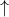

# 8-Traffic_lights

## 1. Preparation tasks 

### State table

| **Input P** | `0` | `0` | `1` | `1` | `0` | `1` | `0` | `1` | `1` | `1` | `1` | `0` | `0` | `1` | `1` | `1` |
| :-- | :-: | :-: | :-: | :-: | :-: | :-: | :-: | :-: | :-: | :-: | :-: | :-: | :-: | :-: | :-: | :-: |
| **Clock** |  |  |  |  |  |  |  |  |  |  |  |  |  |  |  |  |
| **State**     | A | A | B | C | C | D | A | B | C | D | B | B | B | C | D | B |
| **Output R**  | `0` | `0` | `0` | `0` | `0` | `1` | `0` | `0` | `0` | `1` | `0` | `0` | `0` | `0` | `1` | `0` |

### Figure with connection of RGB LEDs on Nexys A7 board

### Table with connection of RGB LEDs on Nexys A7 board
| **RGB LED** | **Artix-7 pin names** | **Red** | **Yellow** | **Green** |
| :-: | :-: | :-: | :-: | :-: |
| LD16 | N15, M16, R12 | `1,0,0` | `1,1,0` | `0,1,0` |
| LD17 | N16, R11, G14 | `1,0,0` | `1,1,0` | `0,1,0` |

## 2. Traffic light controller

### State diagram

### VHDL code of sequential process `p_traffic_fsm`

### VHDL code of combinatorial process `p_output_fsm`

### Screenshots of the simulation

